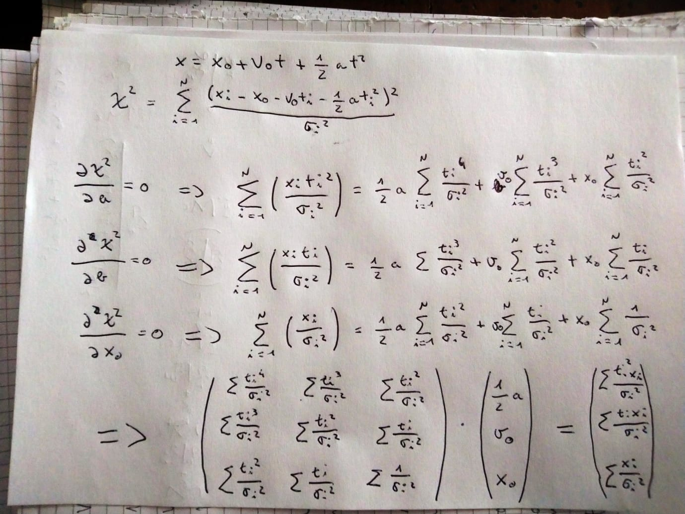

# Overview

### Exercises 2.1 and 2.2
- Ex 2.1 is rewritten using numpy arrays (`decay.py`). Using the numpy formalism one can avoid to directly loop over the
  remaining nuclei creating a numpy array of random numbers. The result of the decay process is compared with the exponential
  distribution showing good agreement
- Ex 2.2 is solved in `n_decays.py`. Please note that the `ROOT TH1D` is filled using the method `fill_hist` from root_numpy(`pip install root_numpy`)
-  The result of 100000 experiments is compared with the binomial and the poissonian
  distributions. As expected, the binomial distribution is in close agreement with the simulated data. The
  poissonian shows a good agreement only when alpha == 4*10^-5 (but still a left shift is clearly visible).

### Exercise 3.5
- Ex 3.5 is solved in `confidence_intervals.py`
- The helper function compute_confidence_interval calculates gaussian CI for 
  central, upper and lower CI. Morevorer if the variance is not provided the interval is computed using the appropriate
  tStudent distribution. The calculation of CI is performed evaluating the cumulative density function of the gaussian/tstudent
  distribution until the required significance alpha is reached. I just mention that the library scipy provides methods to compute automatically
  the CI for the gaussian and the tStudent distributions( `scipy.stats.norm.interval` and `scipy.stats.t.interval`) that I used to check the results
  that I have obtained "manually"
- The confidence intervals with mean mu bounded to zero are computed in `FC_intervals.py` and reported in `confidence_intevals.py`( to run 
  `FC_intervals.py` you should install the package gammapy [`pip install gammapy`]).The FC intervals are slightly shifted to higher values
  with respect to the standard ones
- The CI computed supposing the variance unknown is reasonably larger than the corresponding standard one and includes also values
  below 0

### Exercise 4.2
- The calculation for writing the linear system of equation that minimize the chi^2 is reported in the figure below 
- The system is solved using the method of numpy : `np.linalg.solve()`
- The inverted matrix is used to extract the errors on the parameters(square root of the diagonal) and the correlation matrix
- The position at t=1s and its error is evaluted taking into account the correlations between the fit parameters
- The method is compared with the Minuit(to use it: `pip install iminuit`) minimizer showing an almost total agreements
  
